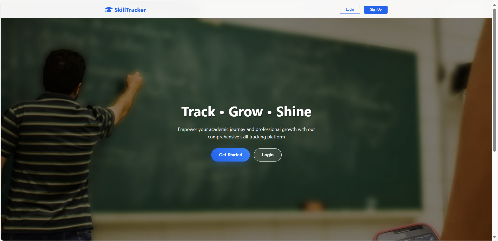
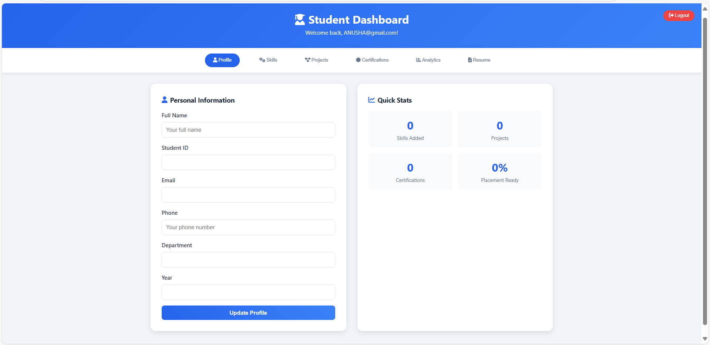
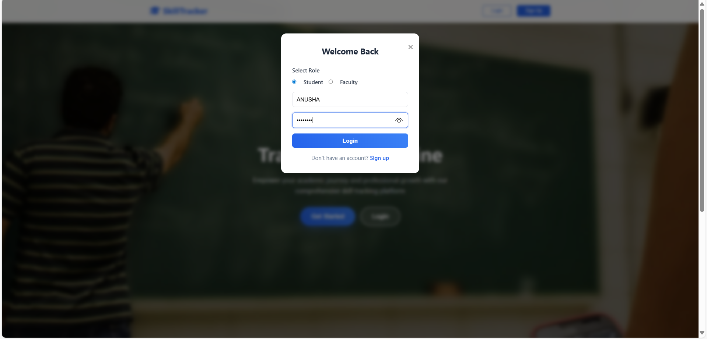
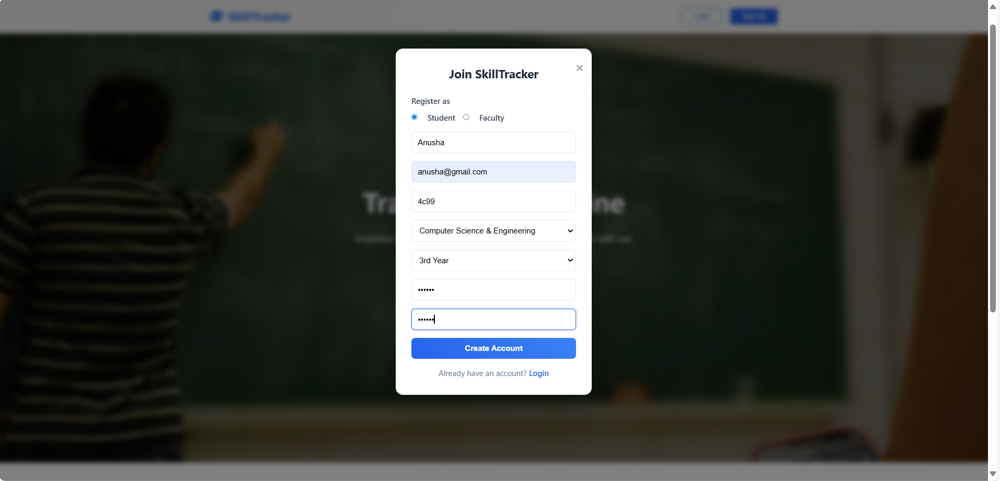

# Student Skill Tracker System

## 📖 Project Description

The Student Skill Tracker System is a web-based platform designed to help students manage and showcase their academic and professional growth. Students can create profiles with personal and academic details, add and rate both technical and non-technical skills, and upload certifications and course documents. They can also maintain a project portfolio with descriptions, technologies used, and links to their work. The system provides skill analysis through charts and reports, and includes an automatic resume generator to create professional resumes easily. Admins and placement officers have tools to search and filter students based on skills, CGPA, and experience, facilitating efficient candidate shortlisting. The system calculates a placement readiness score to assess student preparedness and allows students to upload important documents like mark sheets and resumes. Notifications and alerts keep students informed about profile updates and upcoming job opportunities. Overall, this system streamlines skill tracking, encourages continuous learning, and supports successful placement outcomes.

---

## Screenshots 🖼  

| *Home Page* | *Student Dashboard* |
|-------------|----------------------|
|  |  |

| *Login Page* | *Signup Page* |
|--------------|---------------|
|  |  |

